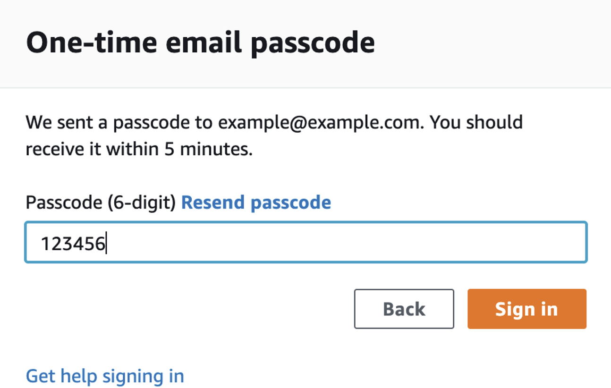
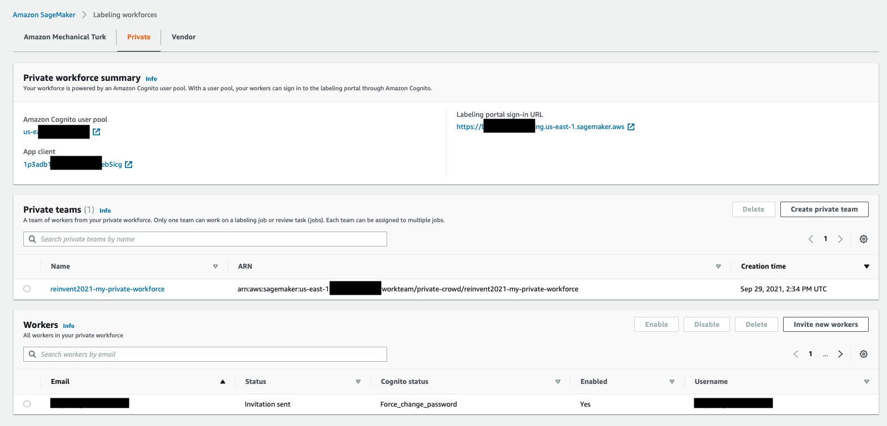
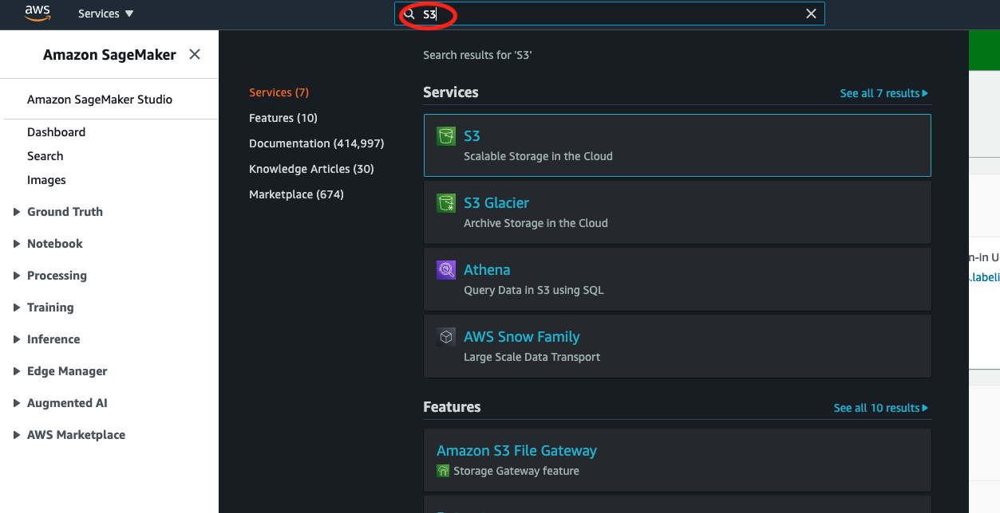
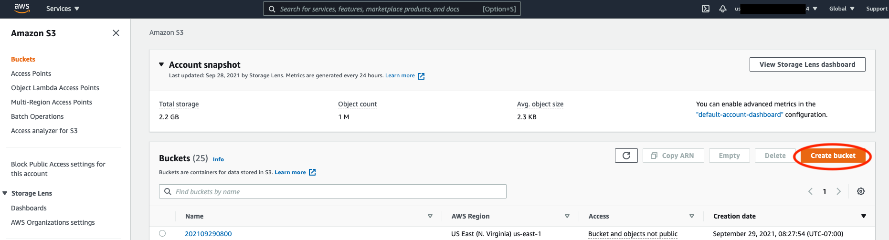
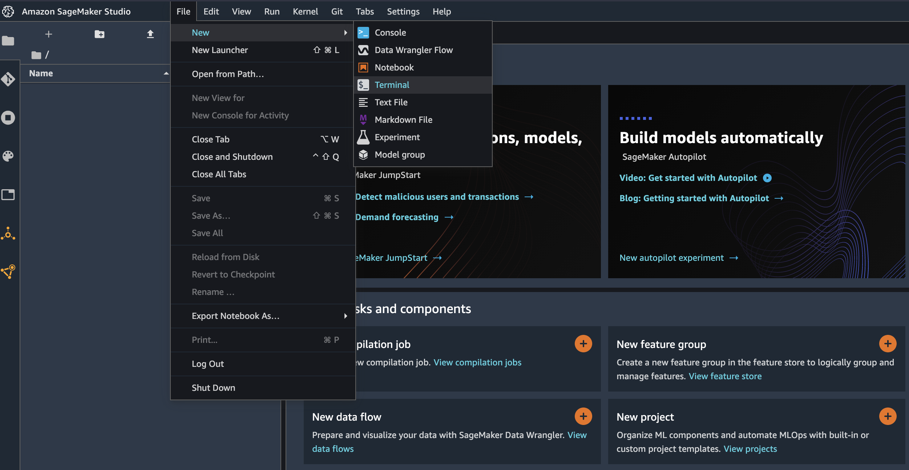
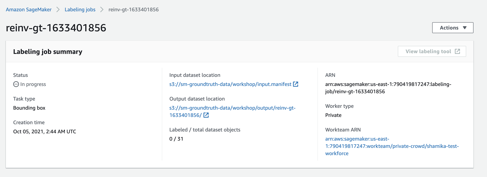

# Easily label training data for machine learning at scale (AIM-406) 
### Summary 
In this session you will learn how to create high-quality labels while also reducing your data labeling costs by up to 70 percent. This session walks through the different workflow options in Amazon SageMaker Ground Truth, such as automatic labeling and assistive labeling features like auto segmentation and Image label verification. We will walk you through how to build highly accurate training dataset for company brand/logo so you can build a ML model for company brand protection.

Table of Content 
<TODO>

Problem Definition
<TODO> 

Setup Env
<TBD EE or awslabs>

Workshop

### Step 0 : Login to event engine.
## AWS Instructor-Led lab
Go to: https://dashboard.eventengine.run/login. You will be redirected to the page
below

Enter the event hash you have received from your instructor

Click on Email One-Time Password (OTP)

You are redirected to the following page:

Enter your email address and click on Send passcode

You are redirected to the following page

Check your mailbox, copy-paste the one-time password and click on Sign in.

You are redirected to the Team Dashboard. Click on AWS Console.

Click “Open AWS Console”

### Step 1 : Create Sagemaker Ground Truth Workforce

Amazon SageMaker Ground Truth gives you access to different workforce options:
* Amazon Mechanical Turk – You get access to an on-demand, 24/7 workforce of over 500,000 independent contractors worldwide. This option is recommended for non-sensitive data.
* Private – You can setup up access for a team of your own employees or contractors. This option is recommended for sensitive data or when domain expertise is required for the labeling job.
* Vendor managed – You can get access to a list of third-party vendors approved by Amazon, who specialize in providing data labeling services, available through AWS Marketplace.

For this tutorial, we use `Private` workforce with you as the labeling member to label our dataset label a dataset with images of brand logos. Let's get started.

1. Navigate to the Amazon SageMaker console by clicking typing SageMaker at the search bar as seen below. 

2. Select the Ground Truth on the left pane.

3. Select Labeling Workforces.

4. Select the tab that reads private and select 'Create Private Team'

5. Select 'Create Private Team with AWS Cognito'. Enter details for 'Team Details' and 'Email Addresses' sections. Ensure that you have access to the email address you provide.

6. Review the Summary.

Copy the ARN listed below. (This will be used later.)

### Step 2 : Create S3 bucket to hold the labelling data.

1. Using Service Locator, search for S3.

2. Create a bucket.

3. Give the bucket a unique name and ensure that it is in the same region where the Ground Truth was created. 

Copy name of the S3 bucket. (This will be used later.)

### Step 3 : Navigate to the SageMaker Studio

Navigate to AWS Console and using service locator search for Sagemaker Studio.
Next, Click on Create Sagemaker Studio.
You should already see a user - "sagemakeruser" created for you.
Once you select this user, you will be directed to Launcher screen.
Within Notebook and Compute Resources section, select a python 3 Notebook as show below.

### Step 4 : Download the notebook code

### Step 5 : Notebook execution.

Change the following cell with the values copied in step 1 & step 2 above.

Follow the intructions and execute all the cells in the notebook.

### Step 6 : Verify the labelling job creation

1. Navigate to the Sagemaker console via service locator.

2. Click on the "Ground Truth" and "Labelling Jobs". 

3. You can see a labelling job with "inprogress" status. Click on the job name.

4. You could see the more details about the job that we created.

### Step 7 : Start the labelling process.

1. 

### Step 3 : Create the Amazon SageMaker Ground Truth labeling job.

1. Create Sagemaker Ground Truth private workforce.
2. Upload images file which needs to be labeled to S3 for company brand detection use case, this is more on object detection use case. (We will pre-populate this files, to event engine account so that customers do not want to download the re-upload to s3)
3. Create the Amazon SageMaker Ground Truth labeling job.

4. Involve in the data labelling process as a worker.
5. Review labeling job results.
6. Enrich the labelling job with automatic labelling and reduce the cost.
7. Future Extensions (Example blogs, references etc)

Test
