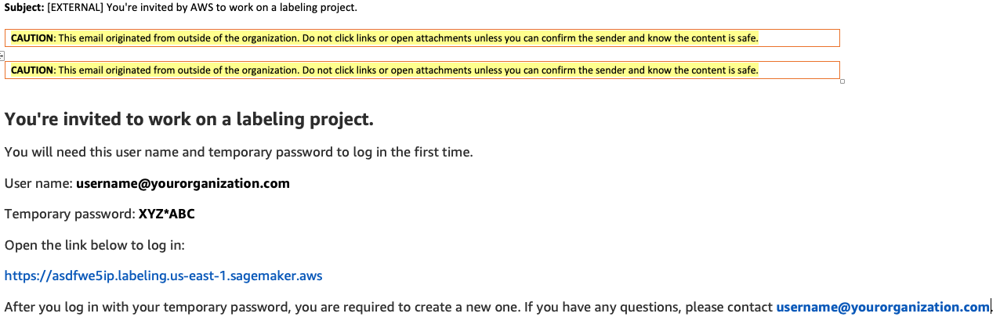
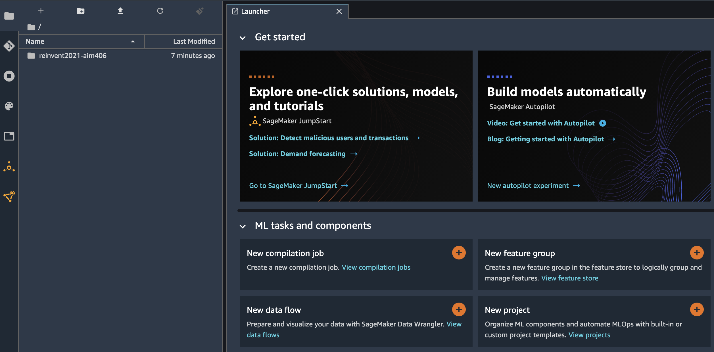

# Easily label training data for machine learning at scale (AIM-406) 

### Summary 
Brand protection is one of the top priority for any enterprise. It not only helps to stop counterfeit sales but also prevent brand image. Using AI and machine learning we can help companies to protect their brand from different sources including social media. However to build a machine learning model for brand protection use case you need a large, high-quality, labeled dataset. Amazon SageMaker Ground Truth will help you build high-quality training datasets for your machine learning models. With Ground Truth, you can use labelers from either Amazon Mechanical Turk, a vendor company that you choose, or an internal, private workforce along with machine learning to enable you to create a labeled dataset. You can use the labeled dataset output from Ground Truth to train machine learning model on Amazon SageMaker or using our AI services such as Amazon Rekognition for computer vision use cases .

In this builder session you will explore how to use Amazon Sagemaker Ground Truth to out-source the image labelling processes to obtain high-quality labels for building a company brand/logo detection machine learning model in a cost effective manner. 

### Workshop Details
1. Create Sagemaker Ground Truth private workforce.
2. Create S3 bucket to upload Brand logo images. 
3. Navigate to Sagemaker studio notebook and download the notebook code. 
4. Execute the notebook code. 
5. Create and verify the labelling job 
6. Login to the portal and start labelling job. 
7. Verify results. 

## Pre-requisites:

### Login to event engine

- Go to: https://dashboard.eventengine.run/login. You will be redirected to the page below

- Enter the event hash you have received from your instructor

- Click on Email One-Time Password (OTP)

- You are redirected to the following page

- Enter your email address and click on Send passcode

- You are redirected to the following page

- Check your mailbox, copy-paste the one-time password and click on Sign in

- You are redirected to the Team Dashboard. Click on AWS Console

- Click “Open AWS Console”

## Step 1 : Create Sagemaker Ground Truth Workforce

Amazon SageMaker Ground Truth gives you access to different workforce options:

* Amazon Mechanical Turk – You get access to an on-demand, 24/7 workforce of over 500,000 independent contractors worldwide. This option is recommended for non-sensitive data.
* Private – You can setup up access for a team of your own employees or contractors. This option is recommended for sensitive data or when domain expertise is required for the labeling job.
* Vendor managed – You can get access to a list of third-party vendors approved by Amazon, who specialize in providing data labeling services, available through AWS Marketplace.

For this tutorial, we use `Private` workforce with you as the labeling member to label our dataset label with images of brand logos. 

Let's get started.

1. Navigate to the Amazon SageMaker console by typing SageMaker at the search bar as seen below. 

2. Select GroundTruth on the left pane.

3. Select Labeling Workforces.

4. Click on Private tab and select 'Create Private Team'

5. Select 'Create Private Team with AWS Cognito'. Enter your Team name under Team details and type your email address, your organization name under Add workers section and click on Create private team. Ensure that you have access to the email address you provide.

6. Review the Summary and copy your Private teams ARN into a notepad. We will be using that later in the lab. 

7. Similar to the below example email, you should have received a confirmation email to the email address you provided in step 5. 

Copy your User name and Temporary password into your notepad. We will use them to login to the labelling portal. 

## Step 2 : Create S3 bucket to hold the labelling data.

1. Using Service Locator on top, search for S3.

2. Click on Create bucket

3. Give the bucket a unique name <(yourname-reinvent-2021)> and leave everything default and click on Create bucket. Ensure that it is in the same AWS region as Ground Truth. 

Copy your bucket name into your notepad. We will use it in our Sagemaker notebook. 

## Step 3 : Navigate to the SageMaker Studio

1. Navigate to the Amazon SageMaker console by typing SageMaker at the search bar as seen below.

2. Click on Open SageMaker Studio. 

3. You should already see a user "sagemakeruser" created for you. Click on Open Studio, you will be directed to Launcher screen.

## Step 4 : Download the notebook code

1. With in Sagemaker Studio Click on File -> New -> Terminal 

2. In Terminal type git clone <(url)>

3. You should now see reinvent2021-aim406 folder on the right pane

4. Click and open ipynb notebook from the folder downloaded

## Step 5 : Notebook execution.

Replace the below values with your Bucket name and private workteam ARN that you copied to your notepad. 

Follow the intructions and execute all the cells in the notebook.

## Step 6 : Verify the labelling job creation

1. Navigate to the Sagemaker console via service locator on top and select "Ground Truth" -> "Labelling Jobs". 

2. You should now see a labelling job with "In progress" status. Click on the job name.

3. Under labeling job summary, you should be able to see more details. 

## Step 7 : Start the labelling process.

1. Go back to the "Private workforce summary" located at Ground Truth -> Labeling Workforce -> Private. Then click on the "Labeling portal sign-in URL"

This will open the application on a new browser tab. 

2. Login using the Username and password you receieved previously. (Change and enter new password when prompted)

3. Select the task and click on Start working to start the labeling job.

4. In the labeling window, Select the appropriate label, draw the bounding box containing that logo and click on Submit. Please see the example below.

5. Continue the process until all the images are completed. 

6. You just finished labeling your first batch of images. GroundTruch will now use this set to train a model for auto-labeling. It will then attempt to label the rest of the images using this model. The auto-labeled images with high degress of confidence will be considered "done" (labeled). A sub-set of images with low degree of confidence will be dispatched to you for another round of labeling, after which Ground Truth will re-attempt to auto-label again. 

Since the set we labeled was very small, it is safe to assume that Ground Truth built model will NOT have high degree of confidence labeling the rest of the images. If you keep refreshing the labeling queue (in the labeleing workforce UI), in about 5 mins or so you will see another batch being dispatched to you for labeling.

## Step 8 : Verify results

1. Using the Service Locator, navigate to S3 bucket that you captured in Step 2.3. Within it, look for a folder with prefix you used in Step 5. Drill through the folder structure as shown below.

2. You should be able to find multiple folders with json files within them as shown below.

3. Download the json file and inspect the contents.

## Step 9 : Automatic labeling

1. It takes few hundreds of labeled images for Ground Truth to train a model which can label the rest of them with relatively high degree of confidence. To illustrate the accuracy of Ground Truth automatic labeling, we pre-processed a different batch of 1000 pictures ahead of time and here is the breakdown of human vs automatic labeling stats:

2. If we inspect output manifest of a completed auto-labeling job, we can see which images were labeled by humans vs automatically:

