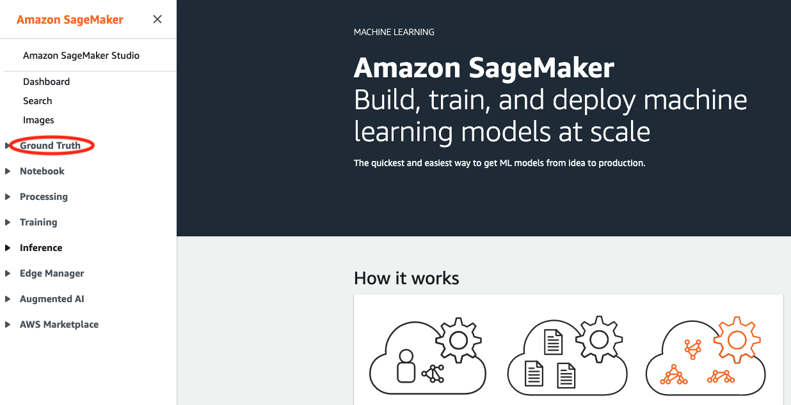
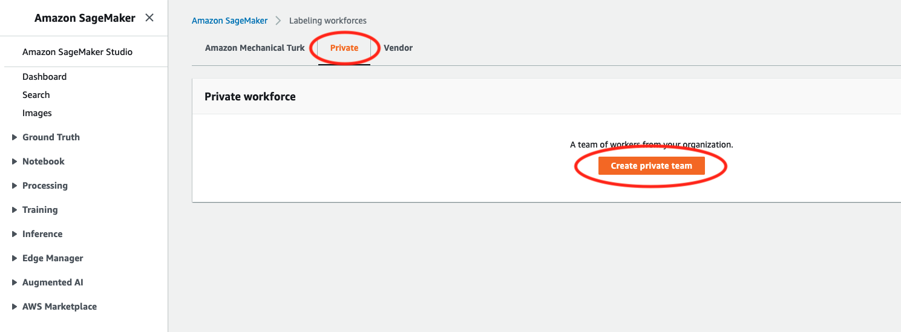
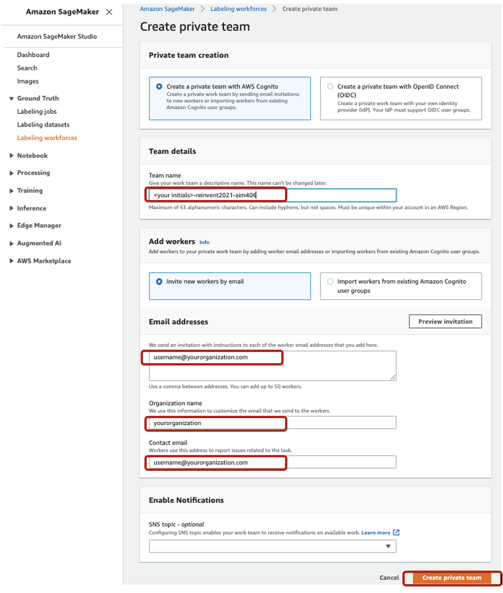
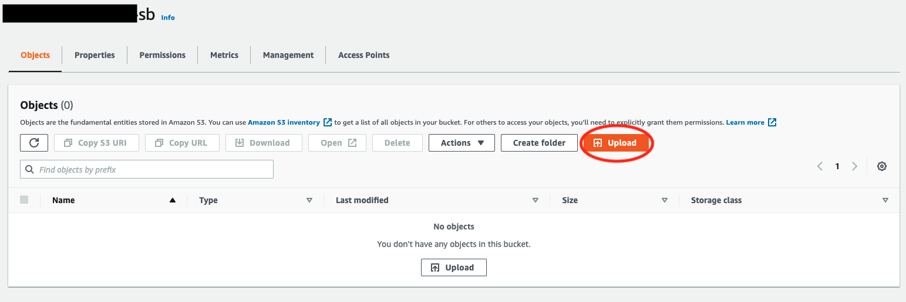
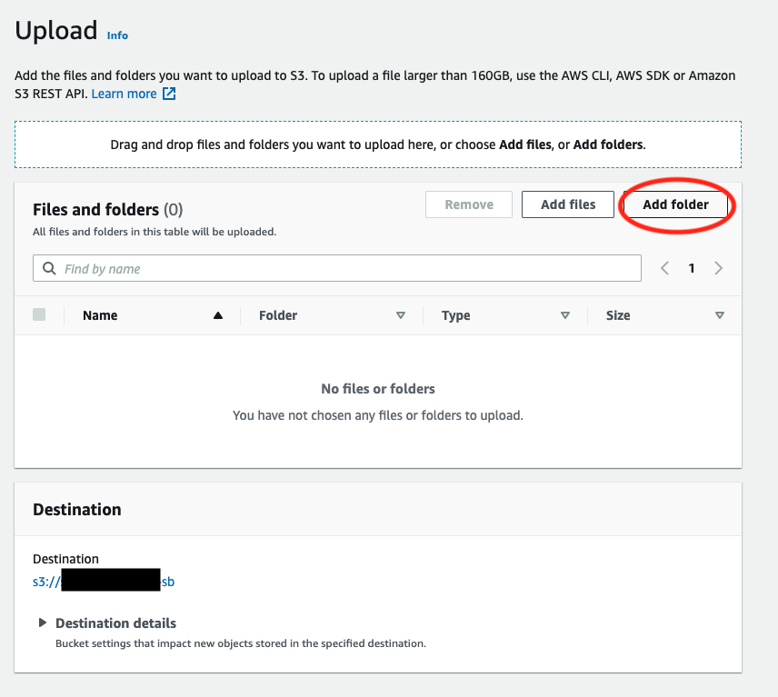

# Easily label training data for machine learning at scale (<TBD add the event title>) 

Table of Content 
<TODO>

Problem Definition
<TODO> 

Setup Env
<TBD EE or awslabs>

Workshop

### Step 1 : Create Sagemaker Ground Truth Workforce

Amazon SageMaker Ground Truth gives you access to different workforce options:
* Amazon Mechanical Turk – You get access to an on-demand, 24/7 workforce of over 500,000 independent contractors worldwide. This option is recommended for non-sensitive data.
* Private – You can setup up access for a team of your own employees or contractors. This option is recommended for sensitive data or when domain expertise is required for the labeling job.
* Vendor managed – You can get access to a list of third-party vendors approved by Amazon, who specialize in providing data labeling services, available through AWS Marketplace.

For this tutorial, we use `Private` workforce with you as the labeling member to label our dataset label a dataset with images of brand logos. Let's get started.

1. 

### Step 2 : Upload the labelling dataset 

### Step 3 : Create the Amazon SageMaker Ground Truth labeling job.

1. Create Sagemaker Ground Truth private workforce.
2. Upload images file which needs to be labeled to S3 for company brand detection use case, this is more on object detection use case. (We will pre-populate this files, to event engine account so that customers do not want to download the re-upload to s3)
3. Create the Amazon SageMaker Ground Truth labeling job.
4. Involve in the data labelling process as a worker.
5. Review labeling job results.
6. Enrich the labelling job with automatic labelling and reduce the cost.
7. Future Extensions (Example blogs, references etc)

Test
